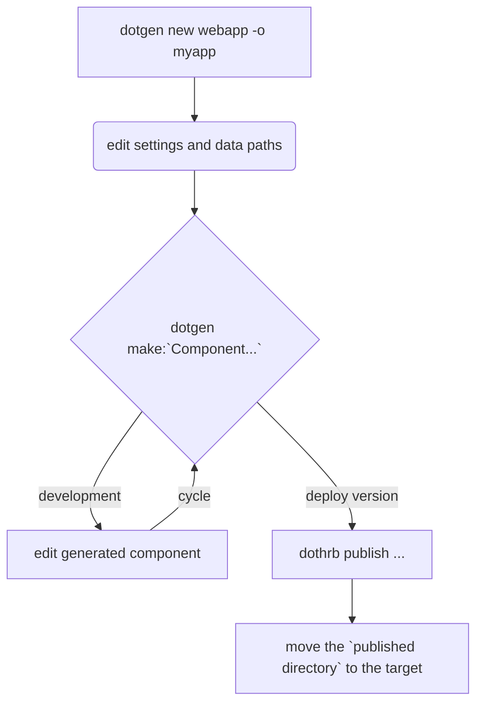

# DotHrb

**DotHrb** is a multi-platform, multi-threading Http Application Server for the Harbour Language aimed to easy the migration of Harbour legacy code to modern PWAs.

### Core Characteristics

Actually SDKs and Runtimes are available for:

- **Linux x64**, **Linux arm64**, **Raspbian arm64**, **MacOS x64**, **MacOS arm64**, **Windows x64**

DotHrb applications are fully portable across all supported environments, requiring no recompilation. The code is bundled into a single application file, allowing teams to share the same Git repository and publish the application on Windows, macOS, or Linux, regardless of the operating system used for creation. **(It requires a minimal binary installation of the Harbour Language but a C toolchain is not required to build DotHrb applications).**

A typical **DotHrb** workflow is based on templates already present in the SDK but that can be added, customized and extended by the user to easy the creation of common used patterns.

All the components are compiled on fly to Harbour classes. The UI is defined using HTML files with special @functions(...) to automate grids, forms, reports and so on. All the Harbour code is bundled inside a single .dllx file to provide code integrity and security. Static content like css and js is minimized and bundled automatically buring the publishing step and everything can be moved to the deployment site as it is.
