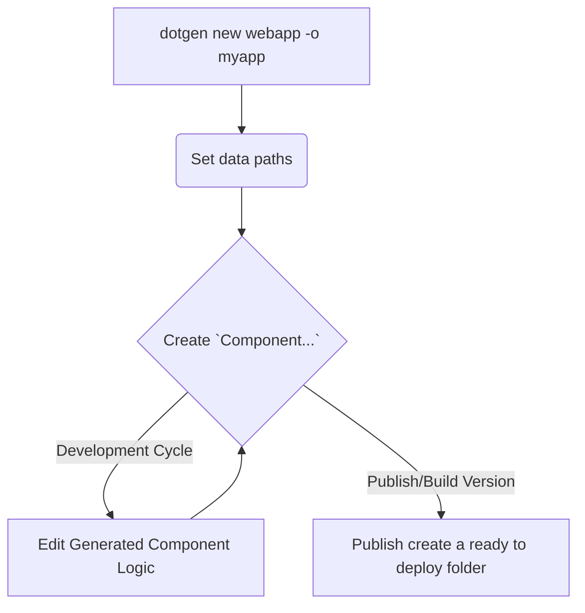

# DotHrb Intro

##  Modernizing Harbour Applications 🚀

**DotHrb** is a **multi-platform, multi-threading HTTP Application Server** for the **Harbour Language**. It's specifically designed to simplify and accelerate the migration of **legacy Harbour code** into modern **Progressive Web Applications (PWAs)**.

-----

## Key Features & Benefits

### Cross-Platform Powerhouse

DotHrb applications are built for versatility and portability.

| Operating System | Architecture |
| :--- | :--- |
| **Linux** | x64, arm64 (including **Raspbian**) |
| **macOS** | x64, arm64 |
| **Windows** | x64 |

  * **Zero Recompilation:** Your application is **fully portable** across all supported environments, requiring **no recompilation** when moving between operating systems.
  * **Simplified Collaboration:** The entire codebase is bundled into a single application file. Teams can share the same Git repository and publish the application on Windows, macOS, or Linux, regardless of the developer's OS.
  * **Minimal Dependencies:** While a minimal binary installation of the Harbour Language is needed, **a C toolchain is NOT required** to build DotHrb applications, streamlining the setup process.

### Rapid Development Workflow

The **DotHrb** workflow is designed for speed and consistency, leveraging SDK templates that users can easily **add, customize, and extend** to enforce common development patterns.

### Security & Optimization

  * **On-the-Fly Compilation:** All components are compiled on the fly into **Harbour classes**, ensuring modern, object-oriented structure.
  * **Secure Bundling:** All Harbour code is bundled within a single **`.dllx` file**, providing enhanced **code integrity and security**.
  * **Automated UI Generation:** The user interface is defined using standard **HTML files** augmented with special `@functions(...)` to automatically generate complex elements like **grids, forms, and reports**.
  * **Deployment Ready:** During the publishing step, static content (like CSS and JS) is **automatically minimized and bundled**. The resulting package is ready for deployment, requiring no further modifications.
